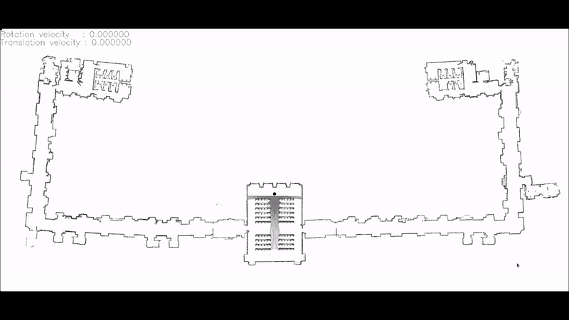

# RobotProgramming - 2D Multi-Robot Simulator
### Project by Gianmarco Scarano | ID: 2047315

<p align="center">
  
</p>

This repo contains the project assigned during the Robot Programming course at AI & Robotics Master's Degree at University of Sapienza in Rome, Italy.<br>

The task is to extend the 2D Robot simulator illustrated during the course by implementing some non-trivial modifications.

## Todo List
❌ = Not yet implemented <br>
⚠️ = Work in progress<br>
✅ = Done<br>

- Implementing **ROS** Support | ✅
- Implementing a **configuration system** by file | ✅
- Complete the **CMakeLists** provided by us | ✅

## Run the code
To launch this simulator, first build the project using the build.sh script given in this repo:
```sh
. build.sh
```

then, simply run its node as follows:
```sh
rosrun mrsim mrsim_node <config>.json
```

Various configs can be found inside "workspace/src/mrsim/test_data/" directory.

## Simulating Robot movements, acquiring Odometry etc.
In order for you to move a Robot, get its Odometry or get informations about its Laser scan, you can run the scripts given in this repo:
#### Movement: ```. moveRobot.sh <robotName> <x> <y> <rv>```
#### Odometry: ```. robotOdometry.sh <robotName>```
#### Movement: ```. laserScan.sh <robotName>>```

---

### References
The following links have been used and studied in order to correctly implement odometry and transformations:<br>
- [Static Transform Publisher](http://wiki.ros.org/tf#static_transform_publisher)
- [How to publish an Odometry Transform](http://wiki.ros.org/navigation/Tutorials/RobotSetup/Odom#Using_tf_to_Publish_an_Odometry_transform)
- [Transform between Robot and Map](https://answers.ros.org/question/371517/ros-transform-between-robot-and-map/)